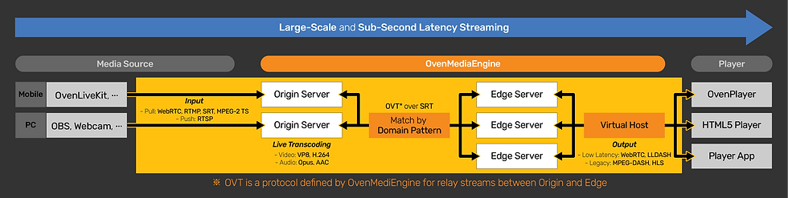

Many services allow you to share your screen with a room of people, such as Discord. While this may work for quickly showing something off, I needed something with more control and higher quality for streaming and movie nights with friends. While searching for the solution, I had a few requirements in mind.

1. Open Source
2. Self Hosted
3. Low Latency
4. New Technologies (to me)

### Nginx RTMP

At first, I found a lot of information surrounding the [Nginx RTMP module](https://github.com/arut/nginx-rtmp-module). Having previously used this, I knew this would not be ideal as it accepts an RTMP input and, with how I configured it, outputs an HLS stream. I wanted to use new technologies that support low latency, which this setup did not.

### OvenMediaEngine

Continuing my search, I found [OvenMediaEngine](https://www.ovenmediaengine.com/). OvenMediaEngine is a sub-second latency live streaming server supporting large-scale deployments allowing streaming to thousands. The best thing about OME is that its open source with a link to the [Github repository](https://github.com/AirenSoft/OvenMediaEngine) on the homepage. OME is a powerful streaming server allowing for complex workflows like the image below taken from the website.



Reading through the documentation, you will quickly find out how powerful OvenMediaEngine is. For live source inputs, OME supports:

- RTMP
- WebRTC
- SRT
- MPEG-2 TS
- RTSP (Pull)

OME also supports a range of streaming outputs:

- WebRTC
- Low-Latency HLS
- Low-Latency DASH _(Deprecated as of v0.14.0)_
- DASH _(Deprecated as of v0.14.0)_
- HLS _(Deprecated as of v0.14.0)_

OvenMediaEngine supports many more features such as transcoding, adaptive bitrate streaming, access control, thumbnails, recording, and clustering. Most of these I will not be talking about as they are overkill for a simple streaming site for friends. Finally, OME has an in-house open source player called [OvenPlayer](https://github.com/AirenSoft/OvenPlayer).

## Getting Started

I will be using Docker to set OME up. There are other install methods in the documentation if that interests you. To get started grab a copy of the `docker-compose.yml` found in the OME [Github repository](https://github.com/AirenSoft/OvenMediaEngine) or use the slightly modified version below adding a Docker volume for the configuration file.

I will be deploying this to Oracle's Free ARM server and as of writing OME only publishes an x86 image. To build an ARM image, clone the OvenMediaEngine repository to your ARM server and edit the `Dockerfile` so the package `build-essential` is installed on line five. Once the modification has been made, build the image with `docker build -t ome .`

```
RUN     apt-get update && apt-get install -y tzdata sudo curl build-essential
```

Modified Docker Compose file.


version: '3.7'

services:
    container_name: ome
    image: airensoft/ovenmediaengine:latest
    ports:
    - "1935:1935/tcp"
    - "3333:3333/tcp"
    - "3478:3478/tcp"
    - "8080:8080/tcp"
    - "9000:9000/tcp"
    - "9999:9999/udp"
    - "4000-4005:4000-4005/udp"
    - "10006-10010:10006-10010/udp"
    environment:
    - OME_ORIGIN_PORT=9000
    - OME_RTMP_PROV_PORT=1935
    - OME_SRT_PROV_PORT=9999
    - OME_MPEGTS_PROV_PORT=4000-4005/udp
    - OME_HLS_STREAM_PORT=8080
    - OME_DASH_STREAM_PORT=8080
    - OME_SIGNALLING_PORT=3333
    - OME_TCP_RELAY_ADDRESS=*:3478
    - OME_ICE_CANDIDATES=*:10006-10010/udp
    command: /opt/ovenmediaengine/bin/OvenMediaEngine -c origin_conf
    volumes:
     - ome-origin-conf:/opt/ovenmediaengine/bin/origin_conf

volumes:
 ome-origin-conf:


This is a simple deployment using an origin only and no edge nodes. Depending on what inputs and outputs you choose to enable, some of the ports in the compose file can be commented out. I will be using SRT as the input and outputting low-latency HLS so I commented out all ports except 9999 and 8050. 

If you want sub-second latency, I would suggest outputting WebRTC. The reason why I am choosing LLHLS is that WebRTC requires viewers to have a stable and fast connection to the server, which some people do not have. LLHLS is more forgiving and still yields decent latency, sitting around 3-5 seconds. Outputting both is an option, but viewers using WebRTC will be 3-5 seconds ahead.

### Configuration

Start the container with `docker compose up` to generate the configuration file then bring it down. The configuration file is located at `/var/lib/docker/volumes/ome_ome-origin-conf/_data/`. Open the `Server.xml` file to configure OME.

I will be going over the minimum to get OME working, take a look at the documentation for more advanced configuration options.

Ensure SRT, or whatever input you are using, is in the `<Bind>` `<Prodivers>` section with the correct port assigned.


<SRT>
	<Port>${env:OME_SRT_PROV_PORT:9999}</Port>
	<WorkerCount>1</WorkerCount>
</SRT>


Below `<Providers>` is the `<Publishers>` tag. Within publishers ensure your output stream is in there. I will be using LLHLS so I added that.

*Note: LLHLS [recommends HTTP/2 for delivery](https://airensoft.gitbook.io/ovenmediaengine/streaming/low-latency-hls) using the commented out TLS port. I use HTTP/1.1 behind a reverse proxy for simplicity reasons.*


<LLHLS>
	<Port>${env:OME_HLS_STREAM_PORT:8050}</Port>
	<!-- <TLSPort>443</TLSPort> -->
	<WorkerCount>1</WorkerCount>
</LLHLS>


Continuing through the configuration file, you will find the `<Applicatons>` section. This is where you can configure multiple streaming applications for different situations. Let's say you would like an application for gameplay streaming that only outputs a bypassed stream using WebRTC. Or a movie night application outputting LLHLS with transcoding enabled. This section can get confusing quickly, so I suggest going through the documentation and configuring it to your needs.

Each application has a few options-name, type, output profiles, providers, and publishers. The name will be used in the URL to input and output from the application. The type will be `live` for live streaming.

Output profiles define if any transcoding should be done or if the input should be sent directly to the output without change. Providers tell the application what inputs to accept. Publishers tell the application what to stream.

My entire configuration is available below, including the application. It makes use of the adaptive bitrate streaming feature by using the `<rendition>` tags. As of writing (v0.14.1), ABR is only supported in LLHLS. Two different qualities are being streamed, one is a bypass, and the other is a 720p video at 2mb/s for users with bad internet connections. In the providers section I'm using SRT, and for the publishers, using LLHLS with the default settings.




With the configuration all done, you should be able to bring the container back up and start streaming. For SRT streaming, the URL is a little complex. The stream name should be unique and is what identifies your stream. In OBS using SRT, the "stream key" field should be left blank.

```
srt://ip:port?streamid=srt%3A%2F%2F{domain or IP address}[%3APort]%2F{App name}%2F{Stream name}
```

Example for SRT:

```
srt://10.10.10.5:9999?streamid=srt%3A%2F%2F10.10.10.5%3A9999%2Fmovie-night%2Frandom-unique-name&latency=400000
```

Appending `&latency=400000` is optional and will add 400ms of latency, but I've found it is much more stable with a latency of two times the ping to your server or more.

Once you start streaming to the OME application, the LLHLS playlist can be accessed using the following link (assuming you have a reverse proxy setup).

```
https://ome.domain.net/APP-NAME/STREAM-NAME-KEY/llhls.m3u8
```

A demo of OvenPlayer is hosted at [https://demo.ovenplayer.com](https://demo.ovenplayer.com/) to test the stream.



## Thoughts

I have been using OvenMediaEngine for a few months to host movie nights with friends, and it's been great. It's simple to setup and configure while supporting many streaming formats. It is actively being developed, with new features being added all the time. The developers are also very helpful and active in the repositories.

If you plan on using OvenMediaEngine, I developed a simple frontend called [Radium](https://github.com/zibbp/radium/tree/next) using OvenPlayer which includes a chat and emotes. 

